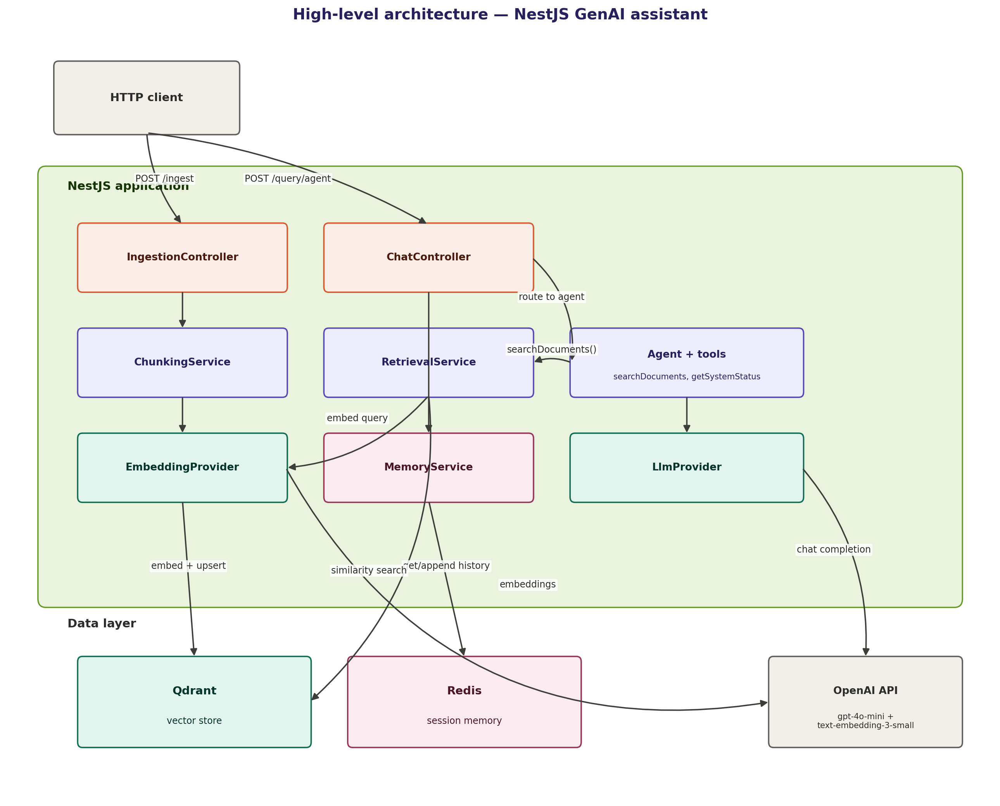
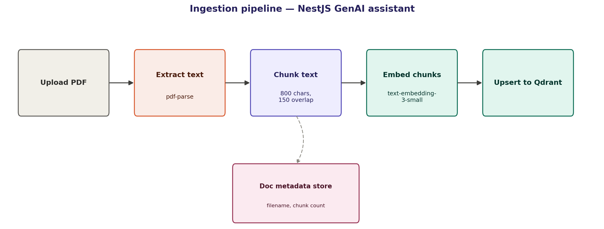
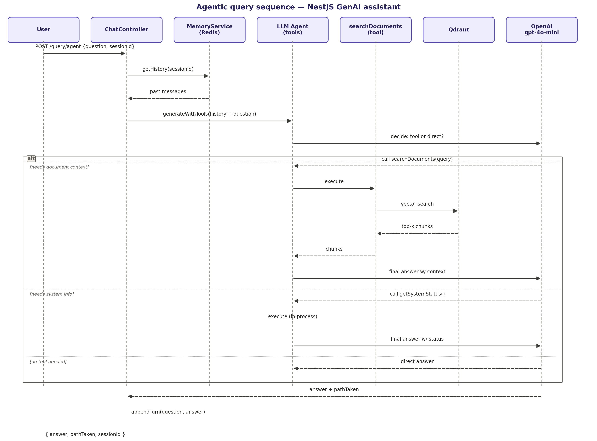

# GenAI Document Assistant

A NestJS backend that answers questions over your own PDF documents using Retrieval-Augmented Generation (RAG) — with an AI agent that decides on its own whether to search your documents, call a system tool, or answer directly, and that remembers the conversation across turns.

## Overview

Most useful information inside a company lives in unstructured documents — PDFs, reports, policy docs — and finding the right answer usually means manually digging through them. This project solves that by turning documents into searchable meaning: upload a PDF, and the system chunks, embeds, and stores it in a vector database. Ask a question, and it retrieves the most relevant pieces and has an LLM generate a grounded answer, citing where the information came from.

What makes this more than a basic RAG demo:

- **Agentic decision-making** — the LLM itself decides per question whether it needs document context, a system status check, or no tool at all, instead of always running a fixed retrieval step
- **Real-time streaming** — answers can stream back token-by-token via Server-Sent Events, the way production chat interfaces actually behave
- **Conversational memory** — follow-up questions correctly resolve against earlier turns in the same session, backed by Redis

Built as a companion to a Python/FastAPI GenAI system, this project demonstrates the same RAG + agentic + memory capability implemented in a production Node.js/NestJS architecture — proving the pattern isn't tied to one language or framework.

## Key Features

- 📄 PDF ingestion — upload, extract text, chunk, and embed automatically
- 🔍 Semantic search over ingested documents via Qdrant
- 🤖 Agentic tool-routing — the model chooses between document search, a system tool, or a direct answer
- ⚡ Streaming responses over SSE
- 🧠 Multi-turn conversation memory via Redis, scoped per session
- 📚 Source citations in every grounded answer

## Tech Stack

- **Framework:** NestJS (TypeScript)
- **LLM & orchestration:** OpenAI (`gpt-4o-mini`), Vercel AI SDK
- **Embeddings:** OpenAI `text-embedding-3-small`
- **Vector store:** Qdrant
- **Session memory:** Redis
- **PDF parsing:** pdf-parse

## Workflow Diagrams

### 1. High-level architecture

### 2. Ingestion pipeline

### 3. Agentic query sequence

## API Endpoints

| Method   | Endpoint                    | Description                                |
| -------- | --------------------------- | ------------------------------------------ |
| `POST`   | `/ingest`                   | Upload and index a PDF document            |
| `GET`    | `/ingest`                   | List ingested documents                    |
| `POST`   | `/query`                    | Ask a question (blocking RAG response)     |
| `GET`    | `/query/stream`             | Ask a question, response streamed via SSE  |
| `POST`   | `/query/agent`              | Agentic query with tool-routing and memory |
| `GET`    | `/query/session/:sessionId` | View conversation history for a session    |
| `DELETE` | `/query/session/:sessionId` | Clear a session's memory                   |
